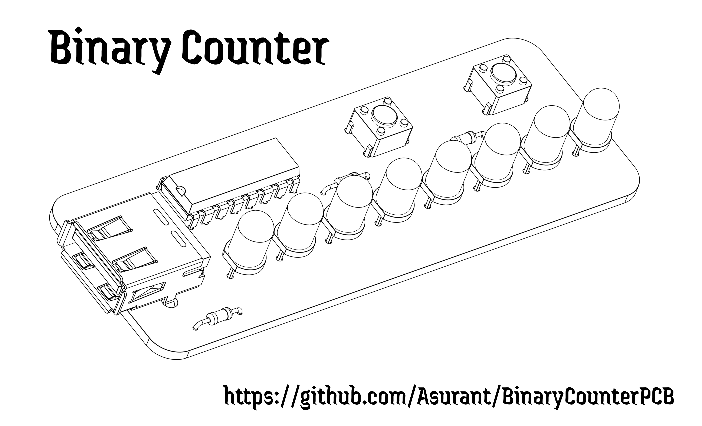
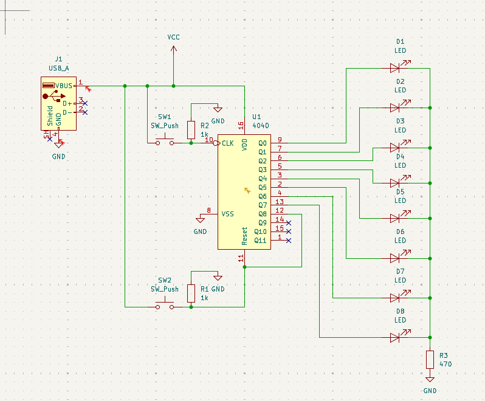
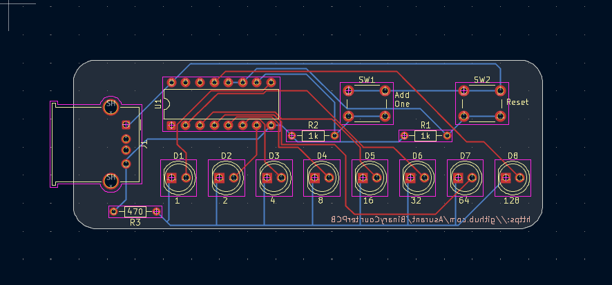

# BinaryCounterPCB

I'm made a binary counter that uses LEDs to show 1s and 0s and can count up to 255. It was made with the help of a CD4040 IC.
## Features
This board has:
- Decimal Values Of Each Binary LED
- An Addition Button For Adding 1 To The Binary
- A Rest Button To Reset The LEDs
## Schematic

## PCB

## BOM

| Designator | Footprint | Quantity | Value |
| :--- | :--- | :--- | :--- |
| D1, D2, D3, D4, D5, D6, D7, D8 | 	LED_D5.0mm | 8 | LED |
| J1 | USB_A_Molex_67643_Horizontal | 1 | USB_A |
| R1, R2 | R_Axial_DIN0204_L3.6mm_D1.6mm_P7.62mm_Horizontal | 2 | 1k |
| R3 | R_Axial_DIN0204_L3.6mm_D1.6mm_P7.62mm_Horizontal | 1 | 470 |
| SW1, SW2 | SW_PUSH_6mm | 2 | SW_Push |
| U1 | DIP-16_W7.62mm | 1 | 4040 |

## Assembly
Overall the components are interchangable as long as you keep them between the same type of components. Put the USB A where is says J1, the CD4040 where it says U1, the switches on SW1 and SW2 (They are the same kind so don't worry about which one you're using), LEDs can be put in whatever order as long as they are put in properly with the positive and negatives going where they should go. However you need to be careful with the resistors. While R1 and R2 are 1k, R3 is 470. So put your 1k resistors to the locations to the right of the CD4040 and put your 470 resistor below the USB A port.
